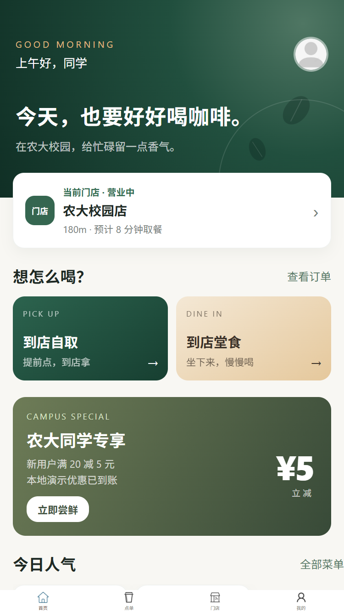
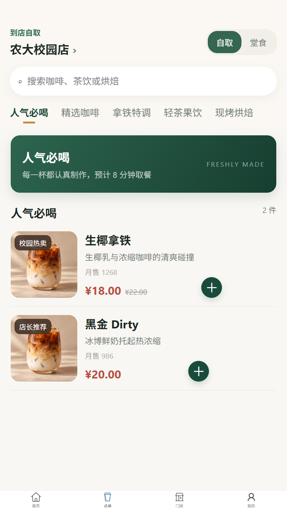
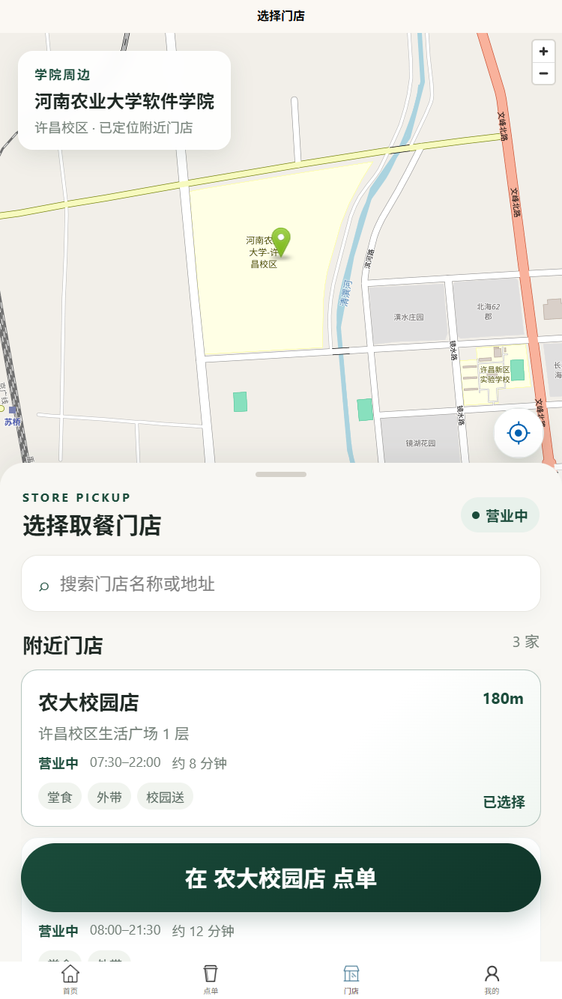
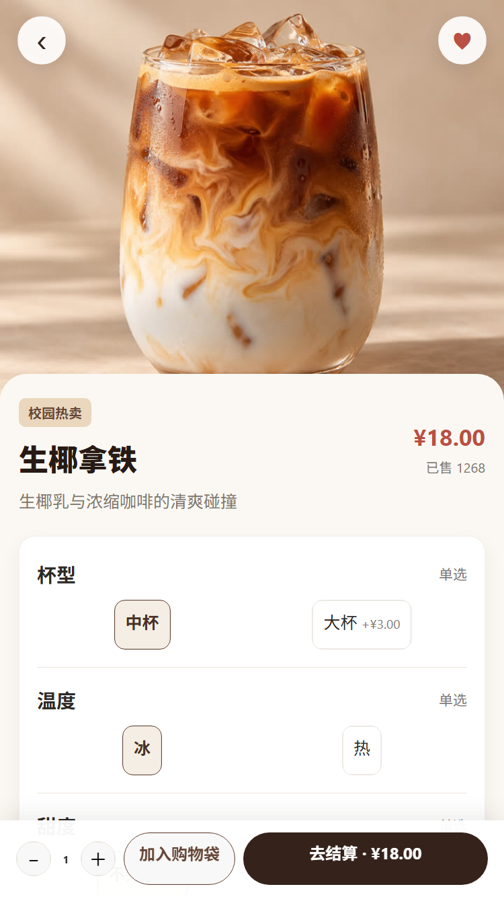
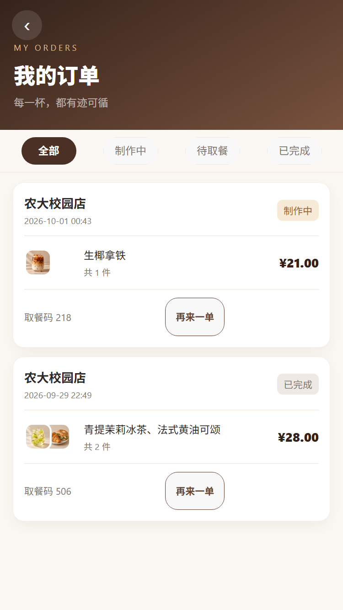
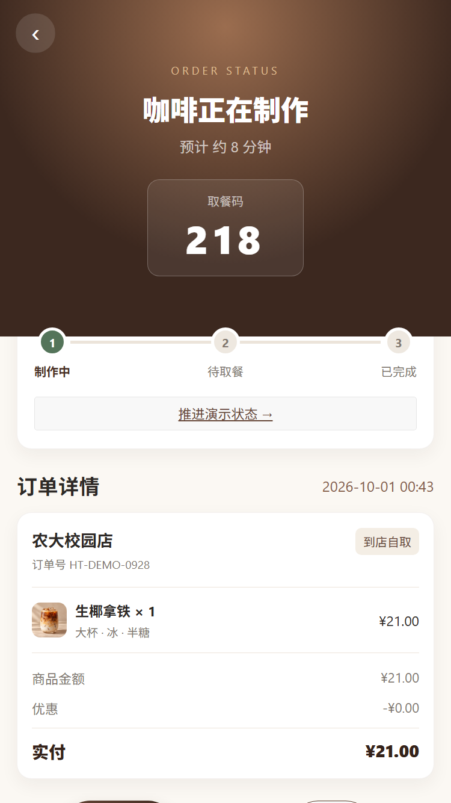

# 校园咖啡点单 · 本地交互展示版

一个基于 Vue 3 与 uni-app 的校园咖啡点单原型。项目已经重构为纯本地演示：无需后端、账号、地图密钥或微信开发者工具，直接在浏览器即可走通完整点单流程，同时保留微信小程序构建能力。

## 展示内容

- 首页：当前门店、自取/堂食、校园活动、人气商品、会员成长
- 门店：默认定位河南农业大学软件学院（许昌校区），展示三家模拟门店
- 点单：分类、搜索、商品规格、购物袋与数量修改
- 结算：取餐时间、优惠券、备注、支付方式和本地模拟支付
- 订单：取餐码、制作进度、状态推进、历史订单与再来一单
- 我的：积分、优惠券、收藏、进行中订单与演示设置
- 数据：购物袋、订单、收藏和积分通过本地存储保留，可一键重置

## 直接运行

```bash
npm install
npm run dev:h5
```

终端显示地址后，用浏览器打开即可。常见地址为 `http://localhost:5173/`。

## 构建

```bash
# 浏览器展示版
npm run build:h5

# 微信小程序产物（需要微信开发者工具才能打开产物）
npm run build:mp-weixin
```

构建产物分别位于 `dist/build/h5` 与 `dist/build/mp-weixin`。

## 页面预览

<p>
  
  
  
</p>

<p>
  
  
  
</p>

## 推荐演示路径

1. 首页点击“到店自取”。
2. 选择一款饮品并调整杯型、温度、甜度或加料。
3. 加入购物袋并进入结算。
4. 使用“新人立减券”，完成模拟支付。
5. 在订单详情页推进“制作中 → 待取餐 → 已完成”。
6. 进入“我的订单”使用“再来一单”。

## 技术说明

- 所有业务数据集中在 `src/data/catalog.js`。
- 全局演示状态集中在 `src/store/app.js`，不依赖额外状态库。
- 页面只依赖 uni-app 基础组件，核心流程完全离线。
- 生成式商品图片已压缩后放入 `src/static/image`，失败时仍有 Emoji 降级。
- 本项目中的支付、定位、门店和会员信息仅用于产品演示，不会发起真实交易或采集真实位置。

重构记录与自评见 [`docs/refactor-progress.md`](docs/refactor-progress.md)。
